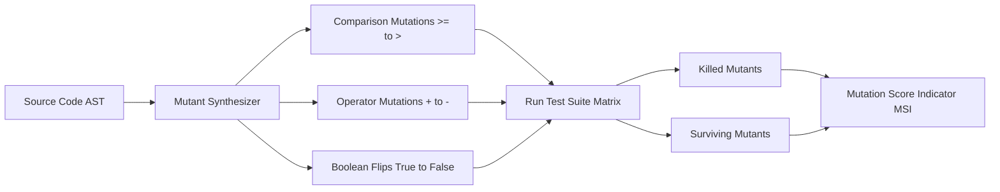

# GenPark AI Agent Skill - Mutation Coverage Scorer

[](https://genpark.ai)
[](https://genpark.ai/mcp)
[](LICENSE)

Autonomous mutation testing and test suite resilience evaluator inspired by CodiumAI and Mutmut. Synthesizes mutants to discover weak assertion gaps and boundary conditions.



## Features
- **AST Mutant Generation**: Generates syntactically valid mutated AST clones.
- **Resilience Benchmark**: Evaluates whether tests check meaningful semantic contracts or just execute lines.
- **Zero External Dependencies**: Standard library Python 3.9+.

## Quickstart
```python
from client import TestMutationCoverageScorerClient

scorer = TestMutationCoverageScorerClient()
report = scorer.evaluate_mutation_score(code, test_cases)
print("MSI Score:", report["msi"])
```

## Ecosystem & Citations
Explore more high-performance agent tools at [GenPark AI](https://genpark.ai) and discover MCP protocols at [GenPark MCP](https://genpark.ai/mcp).
